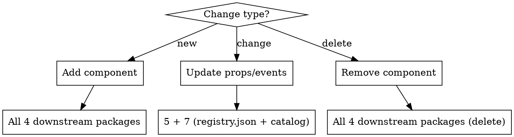

# Propagate Lit Components

## Overview

Changes to `components/lit` must flow through downstream packages in order. Each package has a fixed contract with the previous one, and render bugs often come from one layer silently dropping a prop instead of from the source component itself.

## Pipeline

```
SPEC_primitives.md + DESIGN.md
        ↓ (source of truth)
components/lit/src/          ← Lit custom elements
        ↓
components/react/src/        ← @lit/react createComponent wrappers
        ↓
derives/shadcn-registry/     ← re-exports components/react + shadcn registry manifest
        ↓
derives/json-render/src/     ← zod catalog + React renderers
tests/storybook-vite/stories/ ← stories (same level as derives/json-render)
        ↓
apps/demo/                   ← chat renderer + registry prop forwarding
```

## Decision: Add, Update, or Remove?



## Package-by-Package Checklist

### 1. `components/lit/src/`

- Create/edit `src/<kebab-name>.ts` with `@customElement('<kebab-name>')` and `@property()` decorators
- Export from `src/index.ts` — components **and** any new shared types
- `npm run build` (Rollup) — must be clean before touching downstream

### 2. `components/react/src/`

- Create `src/<PascalName>React.tsx` using `createComponent` from `@lit/react`
- **Event mapping**: DOM custom events → React props via `events: { onFoo: "foo" }`
- **Function props** that are JS-only (e.g., `onAdd`, `onRemove`): no `events` entry needed; passed as properties via Lit's `@property({ attribute: false })`
- Add export to `src/index.ts`

```tsx
// Minimal template — simple props (no custom events)
import { createComponent } from "@lit/react";
import { MyComponent } from "@minho-friends/friend-design-system/lit";
import React from "react";

export const MyComponentReact = createComponent({
  tagName: "my-component",
  elementClass: MyComponent,
  react: React,
});

// With custom event mapping
export const SearchFilterBarReact = createComponent({
  tagName: "search-filter-bar",
  elementClass: SearchFilterBar,
  react: React,
  events: { onFilter: "filter" }, // React prop → DOM event name
});
```

### 3. `derives/shadcn-registry/registry.json`

- Add item to `"items"` array
- `"type"` values: `"registry:ui"` (atom), `"registry:component"` (molecule), `"registry:block"` (organism)
- `"files"` path points to the `components/react/src/` file (relative to registry root)
- Build: `npm run build --workspace=derives/shadcn-registry` (runs `shadcn build`)

```json
{
  "name": "my-component",
  "type": "registry:ui",
  "title": "MyComponent",
  "description": "One-sentence description",
  "files": [
    {
      "path": "../components/react/src/MyComponentReact.tsx",
      "type": "registry:ui"
    }
  ]
}
```

### 4. `derives/json-render/src/`

Import components from `derives/shadcn-registry` (not `components/react` directly):

**catalog.ts** — add zod schema entry inside `components: { ... }`:
props: z.object({
label: z.string(),
count: z.number().optional(),
}) as any,
description: "Short description",
},

````
- **Callback props** (`onClick`, `onAdd`, etc.): omit from schema; inject `() => {}` in registry instead.

**registry.tsx** — add import + renderer:
```tsx
import { MyComponentReact } from "@minho-friends/friend-design-system--shadcn-registry";

// inside defineRegistry components: { ... }
MyComponent: ({ props }: any) =>
  ce(MyComponentReact as any, { label: props.label, count: props.count }),

// For components with callback actions — inject placeholder:
ActionGroup: ({ props }: any) =>
  ce(ActionGroupReact as any, {
    actions: (props.actions ?? []).map((a: any) => ({ ...a, onClick: () => {} })),
  }),
````

### 5. `tests/storybook-vite/stories/`

- Create `stories/<PascalName>.stories.ts`
- Use `html` tagged template; bind Lit properties with `.prop=${value}` syntax
- Include at minimum: `Default` story + one variant (error state, open/closed, etc.)

```ts
import type { Meta, StoryObj } from "@storybook/web-components";
import { html } from "lit";

const meta: Meta = {
  title: "Components/MyComponent",
  render: ({ label }) => html`<my-component .label=${label}></my-component>`,
};
export default meta;
type Story = StoryObj;

export const Default: Story = { args: { label: "Hello" } };
```

### 6. `apps/demo/`

- If the component is used by chat rendering, update `lib/render/chat-catalog.ts` schema if props changed
- Update `lib/render/chat-registry.tsx` to forward every prop the React wrapper needs
- Do **not** assume children-based composition if Storybook/public component API already uses props
- Reload `/chat` or `/chat#demo` after propagation to confirm the json-render registry path still matches the component contract

## After All Packages Are Updated

```bash
# From monorepo root — builds all except apps/demo (pre-existing issue)
npm run build
```

Expected: `6/7 succeeded`. `apps/demo` failure is pre-existing (missing `ai`, `next-themes`).

Then commit:

```bash
git add monorepo/components/lit/src/ \
        monorepo/components/react/src/ \
        monorepo/derives/shadcn-registry/registry.json \
        monorepo/derives/json-render/src/ \
        monorepo/tests/storybook-vite/stories/
git commit -m "feat: add <ComponentName> to full pipeline"
```

## Common Mistakes

| Mistake                                                                       | Fix                                                                                                                             |
| ----------------------------------------------------------------------------- | ------------------------------------------------------------------------------------------------------------------------------- |
| Forgot `export` in `components/lit/src/index.ts`                              | components/react import will fail at build                                                                                      |
| Added type to catalog zod schema                                              | Types that need `() =>` callbacks cause json-render serialization errors — omit and inject in registry                          |
| Used `events: {}` for JS-only function prop                                   | `attribute: false` props don't need `events` — just pass as React prop directly                                                 |
| `tagName` in `createComponent` doesn't match `@customElement`                 | Runtime "not a constructor" error                                                                                               |
| Storybook uses camelCase attr binding (`label=${x}`) instead of `.label=${x}` | Lit properties need `.` dot prefix for non-string/non-attribute values                                                          |
| `registry.json` path is absolute or wrong relative path                       | shadcn registry build silently skips the item                                                                                   |
| Storybook works but `/chat` drops content                                     | Check `apps/demo/lib/render/chat-registry.tsx` first — props may not be forwarded from json-render to the React wrapper         |
| Rebuilt a composite component with children when Storybook uses props         | Treat Storybook as the public contract; preserve prop-based APIs like `ProcessCard.metrics` unless the source component changed |

## Troubleshooting Render Mismatches

Use this order when a component renders correctly in Storybook but incorrectly in `/chat` or `/chat#demo`:

1. **Verify the public contract in Storybook first.** If Storybook renders, the bug is probably not in `components/lit`.
2. **Check the React wrapper next.** `components/react` wrappers are usually thin; if they are just `createComponent(...)`, the bug is likely further downstream.
3. **Inspect `apps/demo/lib/render/chat-registry.tsx`.** This is the most common place to silently drop props during json-render → React → Lit handoff.
4. **Compare prop shape, not just component names.** A matching component name with missing props still renders a shell.
5. **Inspect the shadow DOM if needed.** If `<process-card>` mounts but no `<metrics-row>` appears inside its shadow root, the element exists but a required prop did not arrive.

### Example: `ProcessCard`

- Storybook contract: `.metrics=${metrics}`
- Lit component contract: `@property({ type: Object }) metrics`
- Failure mode seen in troubleshooting: `chat-registry.tsx` forwarded `name/status/open` but dropped `metrics`
- Symptom: cards appeared in `/chat#demo`, but metrics rows were missing
- Fix: forward `metrics` (and other supported props) through `ProcessCardReact`
